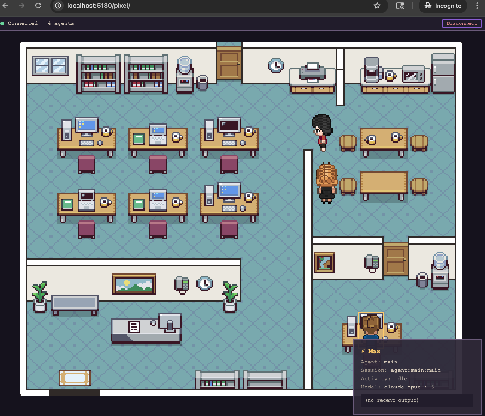
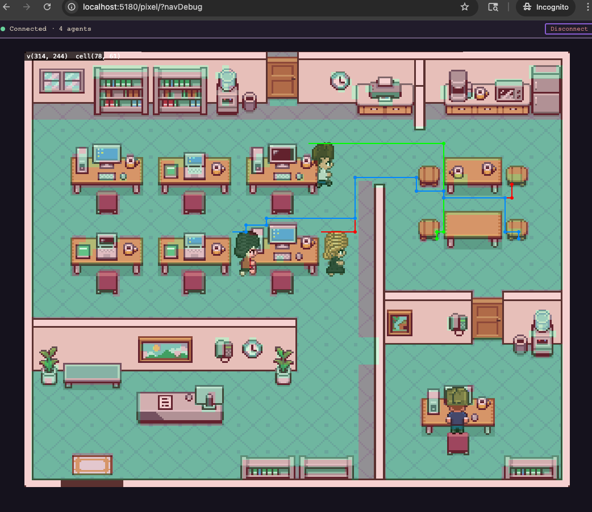

# 🦀 Pixel Claw

A pixel-art RPG-style office visualization for [OpenClaw](https://openclaw.dev) agents. Connect to your OpenClaw Gateway and watch your AI agents work in a charming isometric office — walking between desks, taking coffee breaks, and wandering around.






## Features

- **Real-time agent visualization** — Each active session appears as a pixel character at a desk
- **Activity detection** — Characters animate based on what the agent is doing (thinking, coding, reading, browsing, running commands, communicating)
- **Pathfinding** — Agents navigate around desks, walls, and furniture using BFS pathfinding on an image-derived walkability grid
- **Zone system** — Four office zones (main floor, break room, lead office, sub-agent area) with automatic agent assignment based on role and activity
- **Idle behavior** — Agents walk to the break room when idle, wander between points of interest (coffee machine, couch, bookshelf), and the lead agent paces around their private office
- **Gateway WebSocket connection** — Protocol v3 with token auth
- **Session polling** — Automatically discovers and tracks active agent sessions
- **Click to inspect** — Click any desk to see session details, current activity, and last output
- **Sleeping detection** — Idle agents eventually fall asleep (zzz...)

## Quick Start

```bash
npm install
npm run dev
```

Open `http://localhost:5180/pixel/`, enter your Gateway URL (e.g., `ws://localhost:18789`) and token, then click Connect.

## URL Parameters

Pass connection details via URL:

```
http://localhost:5180/pixel/?gatewayUrl=ws://localhost:18789&token=your-token
```

Debug the navigation grid overlay:

```
http://localhost:5180/pixel/?navDebug
```

## Build

```bash
npm run build
```

Output goes to `dist/`.

## How It Works

### Navigation

The walkability grid is built automatically by sampling pixels from the Donarg office background image. Teal-colored floor tiles are marked walkable; furniture, walls, and decorations are obstacles. A few structural wall blockers are added on top for walls that use floor-colored pixels (the vertical divider wall body is teal).

Agents use BFS pathfinding to navigate between waypoints, following simplified paths that avoid obstacles. The `?navDebug` URL parameter renders the walkability grid overlay and active walk paths.

### Zones & Seating

Agents are assigned to zones based on their role:
- **Lead office** — The primary/lead agent gets a private office
- **Main floor** — Active worker agents sit at desk rows
- **Break room** — Idle agents wander to POIs (coffee machine, couch, etc.)
- **Sub-agent zone** — Spawned sub-agents get their own workspace

Each zone has a fixed seat map. Agents walk to their assigned seat when their zone changes, navigating through doorways between rooms.

## Visual Style

Pixel Claw uses a Donarg office board backdrop plus Pixel Agents-style character rendering.

### Character pipeline attribution

Character motion feel and frame layout are adapted from the MIT-licensed Pixel Agents project:

- https://github.com/pablodelucca/pixel-agents
- See `ASSET_LICENSES.md` for details.

### Design knobs

- `src/visual-system.ts`
  - `VS.palette`: global color tokens (background, walls, trim, UI panel, text, bubble)
  - `VS.fontFamily` + `pixelFont(...)`: centralized pixel typography
- `src/renderer.ts`
  - `SUB_SCALE_FACTOR`: child-agent size ratio
  - global canvas scale clamp in `resize()`
- `src/zones.ts`
  - `OFFICE_SEAT_MAP`: desk/chair positions per zone
  - `BREAK_ROOM_POIS` / `LEAD_OFFICE_POIS`: wandering destinations
  - `NavigationGrid`: image-based walkability + structural wall blockers
- `src/sprites/character.ts`
  - Pixel Agents-based sprite frame selection for activity states
- `src/sprites/effects.ts`
  - thought/status bubble shape, size, and text truncation

## Tech Stack

- Vite + TypeScript
- HTML5 Canvas (no framework)
- WebSocket (OpenClaw Gateway protocol v3)

## License

MIT
